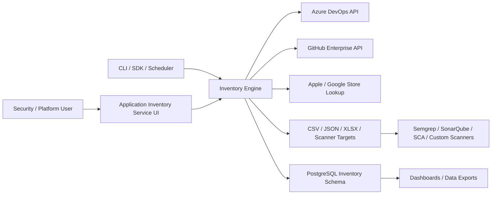

# Architecture

## Logical View

## Runtime Components

| Component | Responsibility |
| --- | --- |
| UI service | Login, credential handling, scan configuration, live logs, report download, database export |
| CLI | Non-interactive scans for automation and scheduled inventory jobs |
| SDK | Importable API for other applications and orchestration processes |
| Inventory engine | Provider traversal, branch selection, detection, metadata extraction, activity extraction |
| Report writer | Streaming CSV, JSON, XLSX, Semgrep, SonarQube, and scanner target outputs |
| PostgreSQL writer | Normalized upserts scoped by owner/user |
| Store lookup client | Optional mobile app store validation |

## Data Flow

1. A user or automation submits source provider credentials and scan options.
2. The service lists accessible projects or repositories.
3. The engine resolves one branch per repository.
4. The engine reads repository trees and selected manifest/configuration files.
5. Detection evidence is converted into inventory types, categories, metadata, contributors, and timestamps.
6. Results stream to local reports and, when enabled, PostgreSQL.
7. Scanner manifests are consumed by downstream security tooling.

## Storage Model

The UI writes local reports and encrypted token state under the configured reports/state directory. In production, mount durable storage such as Amazon EFS. Inventory data should be stored in Amazon RDS for PostgreSQL.

## Security Model

- Provider tokens are read-only and scoped as narrowly as practical.
- Saved UI tokens are encrypted with Fernet.
- PostgreSQL rows are scoped by signed-in user.
- OAuth should be configured with a dedicated callback domain.
- Production secrets should be stored in AWS Secrets Manager and injected into ECS tasks.
