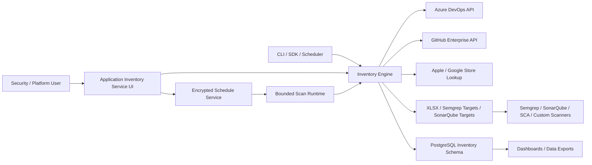

# Architecture

## Logical View

## Runtime Components

| Component | Responsibility |
| --- | --- |
| UI service | Login, credential handling, scan configuration, live logs, report download, database export |
| Scan runtime | Bounded subprocess admission, pause, resume, stop, event delivery, and process cleanup |
| Scheduler | Encrypted user-scoped recurrence definitions and due-run dispatch |
| Request compiler | Scan request validation, command construction, redaction, and restricted child environments |
| Source discovery | Concurrent project and repository discovery for interactive filtering |
| CLI | Non-interactive scans for automation and scheduled inventory jobs |
| SDK | Importable API for other applications and orchestration processes |
| Inventory engine | Provider traversal, branch selection, detection, metadata extraction, activity extraction |
| Report writer | Streaming XLSX inventory, Semgrep target, and SonarQube target outputs |
| PostgreSQL writer | Current-state normalized upserts scoped by owner/user and source identity |
| Store lookup client | Optional mobile app store validation |

## Data Flow

1. A user or automation submits source provider credentials and scan options.
2. Interactive or scheduled work enters the same bounded scan runtime.
3. For a mixed scan, the engine resolves Azure DevOps organizations and GitHub Enterprise owners as separate, concurrent source contexts.
4. The service lists accessible projects and repositories concurrently within configured limits. GitHub owners sharing an App installation also share installation-token state and request pacing.
5. The engine resolves one branch per repository.
6. The engine reads repository trees and selected manifest/configuration files through a bounded queue.
7. Detection evidence is converted into inventory types, categories, metadata, contributors, timestamps, and a provider value.
8. Results from every source stream through the same report writer and PostgreSQL writer. CLI runs do not retain a second in-memory result set.
9. Scanner manifests are consumed by downstream security tooling.

The service emits structured lifecycle, request, scan, and provider-authentication events to the configured PostgreSQL observability table. The UI exposes health and metrics endpoints without exposing provider secrets.

## Storage Model

The UI writes reports, encrypted provider credentials, and encrypted schedules under the configured reports/state directory. The Fernet key must remain stable across restarts. Production deployments should mount durable encrypted storage such as Amazon EFS or Azure Files and store inventory data in managed PostgreSQL.

## Security Model

- Provider credentials are read-only and scoped as narrowly as practical; GitHub Enterprise uses an installed GitHub App by default.
- GitHub App private keys remain in secret storage or a secret-mounted file and are never placed in generated scan commands.
- Saved UI tokens are encrypted with Fernet.
- Scheduled scan configuration and credentials are encrypted with Fernet and scoped by user.
- PostgreSQL inventory and repository keys are scoped by signed-in user.
- Repeated findings update current-state rows; normalized child values are synchronized without duplicate insertion.
- Database search and filtered exports enforce the signed-in user scope in SQL.
- OAuth should be configured with a dedicated callback domain.
- Production secrets should be stored in AWS Secrets Manager and injected into ECS tasks.
