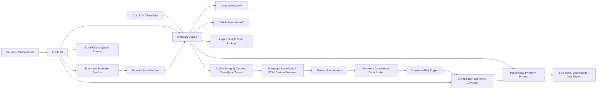

# Architecture

## Logical View

## Runtime Components

| Component | Responsibility |
| --- | --- |
| UI service | Login, credential handling, scan configuration, live logs, report download, database export |
| Scan runtime | Bounded subprocess admission, durable worker recovery, pause, resume, stop, and event delivery |
| Scheduler | Encrypted user-scoped recurrence definitions and due-run dispatch |
| Request compiler | Scan request validation, command construction, redaction, and restricted child environments |
| Source discovery | Concurrent project and repository discovery for interactive filtering |
| CLI | Non-interactive scans for automation and scheduled inventory jobs |
| SDK | Importable API for other applications and orchestration processes |
| Finding ingestion | SARIF, Semgrep, SonarQube, and generic normalization with atomic import audit |
| Finding correlation | Deterministic deduplication and conservative branch-inventory matching |
| Risk engine | Explainable technical and business-context scoring from 0 to 100 |
| Remediation workflow | Status, assignment, due date, notes, immutable events, search, and export |
| Coverage service | Per-application scanner reach and freshness |
| Inventory engine | Provider traversal, branch selection, detection, metadata extraction, activity extraction |
| Domain attribution | Normalized deployment, repository, and configuration evidence linked to source branches |
| Report writer | Streaming XLSX inventory, Semgrep target, and SonarQube target outputs |
| PostgreSQL writer | Current-state normalized upserts scoped by owner/user and source identity |
| Inventory query service | Indexed full-text and structured user-scoped search with streaming exports |
| Local query planner | Ollama-backed natural-language conversion into allowlisted filters; receives no inventory rows |
| Store lookup client | Optional mobile app store validation |

## Data Flow

1. A user or automation submits source provider credentials and scan options.
2. Interactive or scheduled work enters the same bounded scan runtime.
3. For a mixed scan, the engine resolves Azure DevOps organizations and GitHub Enterprise owners as separate, concurrent source contexts.
4. The service lists accessible projects and repositories concurrently within configured limits. GitHub owners sharing an App installation also share installation-token state and request pacing.
5. The engine resolves one branch per repository.
6. The engine reads repository trees and selected manifest/configuration files through a bounded queue.
7. Detection evidence is converted into inventory types, categories, metadata, contributors, timestamps, and a provider value.
8. Network-deployable findings collect bounded domain evidence and select a primary domain by evidence strength and environment.
9. Results from every source stream through the same report writer and PostgreSQL writer. Pending rows commit on a bounded time interval and appear in the active UI table.
10. Database search applies owner scope, indexed text search, structured filters, and a bounded result window. Exports stream through a server-side cursor.
11. Scanner manifests are consumed by downstream security tooling.
12. Scanner result files return through the ASPM ingestion contract and commit atomically.
13. Findings correlate to branch inventory, deduplicate within the source tool, and retain unlinked results when identity is ambiguous.
14. Asset context and exploitability produce explainable risk; users manage remediation through an audited workflow.
15. Scanner target snapshots update coverage and resolve findings absent from declared complete snapshots.

The service emits structured lifecycle, request, scan, and provider-authentication events to the configured PostgreSQL observability table. The UI exposes health and metrics endpoints without exposing provider secrets.

## Storage Model

The UI writes reports, private scan logs, encrypted run state, encrypted provider credentials, and encrypted schedules under the configured reports/state directory. The Fernet key must remain stable across restarts. A detached worker can outlive a local UI process and is reattached only after its PID and process group are verified. Production deployments should mount durable encrypted storage such as Amazon EFS or Azure Files and store inventory data in managed PostgreSQL.

## Security Model

- Provider credentials are read-only and scoped as narrowly as practical; GitHub Enterprise uses an installed GitHub App by default.
- GitHub App private keys remain in secret storage or a secret-mounted file and are never placed in generated scan commands.
- Saved UI tokens are encrypted with Fernet.
- Scheduled scan configuration and credentials are encrypted with Fernet and scoped by user.
- Active and queued run configuration is encrypted with Fernet and never returned by the run API.
- PostgreSQL inventory and repository keys are scoped by signed-in user.
- Repeated inventory and scanner findings update current-state rows; normalized child values are synchronized without duplicate insertion.
- Failed finding imports retain an audit record while finding, identifier, event, and coverage updates roll back atomically.
- Complete scanner snapshots resolve only active findings for explicitly matched application branches.
- Domains and domain evidence sources use separate normalized child tables keyed to branch inventory.
- Domain attribution never performs HTTP or DNS requests to discovered hosts.
- Database search and filtered exports enforce the signed-in user scope in SQL.
- The local query planner receives a question and field schema only. It cannot issue SQL or bypass database authorization.
- OAuth should be configured with a dedicated callback domain.
- Production secrets should be stored in AWS Secrets Manager and injected into ECS tasks.
