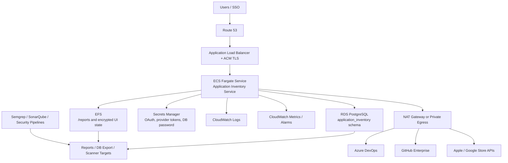

# AWS Deployment Guide

This guide describes a production-ready AWS deployment for Application Inventory Service.

## Recommended Architecture

Use Amazon ECS on Fargate behind an HTTPS Application Load Balancer. Store normalized inventory in Amazon RDS for PostgreSQL. Persist reports and encrypted UI state on Amazon EFS. Store secrets in AWS Secrets Manager and encrypt data with AWS KMS.



## AWS Services

| Service | Use |
| --- | --- |
| ECS Fargate | Runs the container without host management |
| ECR | Stores the container image |
| ALB | Provides HTTPS ingress and health checks |
| ACM | Issues TLS certificate for the UI domain |
| Route 53 | DNS for the service |
| RDS PostgreSQL | Stores normalized inventory |
| EFS | Persists report files and UI state |
| Secrets Manager | Stores OAuth secrets, provider tokens, and database credentials |
| KMS | Encrypts RDS, EFS, Secrets Manager, and log data |
| CloudWatch | Logs, metrics, alarms |
| WAF | Optional edge protection for the ALB |
| NAT Gateway / VPN / Transit Gateway | Outbound access to Azure DevOps or GitHub Enterprise |

## Network Layout

Use at least two Availability Zones.

- Public subnets: ALB and NAT gateways.
- Private application subnets: ECS Fargate tasks.
- Private data subnets: RDS and EFS mount targets.
- Security groups:
  - ALB accepts `443` from approved users or corporate IP ranges.
  - ECS accepts app port `48731` only from the ALB.
  - RDS accepts `5432` only from ECS.
  - EFS accepts `2049` only from ECS.

## Container Build and Push

```bash
AWS_REGION=us-east-1
ACCOUNT_ID=$(aws sts get-caller-identity --query Account --output text)
REPO=application-inventory-service

aws ecr create-repository --repository-name "$REPO" --region "$AWS_REGION" || true

aws ecr get-login-password --region "$AWS_REGION" \
  | docker login --username AWS --password-stdin "$ACCOUNT_ID.dkr.ecr.$AWS_REGION.amazonaws.com"

docker build -t "$REPO:1.6.0" .
docker tag "$REPO:1.6.0" "$ACCOUNT_ID.dkr.ecr.$AWS_REGION.amazonaws.com/$REPO:1.6.0"
docker push "$ACCOUNT_ID.dkr.ecr.$AWS_REGION.amazonaws.com/$REPO:1.6.0"
```

## Required Secrets

Store these in AWS Secrets Manager:

| Secret | Purpose |
| --- | --- |
| `APPLICATION_INVENTORY_SERVICE_SECRET_KEY` | Fernet key for encrypted token storage |
| `APPLICATION_INVENTORY_SERVICE_GITHUB_CLIENT_SECRET` | GitHub OAuth secret |
| `APPLICATION_INVENTORY_SERVICE_GOOGLE_CLIENT_SECRET` | Google OAuth secret |
| `APPLICATION_INVENTORY_POSTGRES_DSN` | PostgreSQL DSN |
| Provider tokens | Optional server-side source provider tokens for automation |

Generate a Fernet key:

```bash
python - <<'PY'
from cryptography.fernet import Fernet
print(Fernet.generate_key().decode())
PY
```

## ECS Task Configuration

Container:

- Image: ECR image pushed above.
- Port: `48731`.
- Command:

```text
ui --host 0.0.0.0 --port 48731 --reports-dir /reports
```

Environment:

| Variable | Recommended value |
| --- | --- |
| `APPLICATION_INVENTORY_SERVICE_UI_HOST` | `0.0.0.0` |
| `APPLICATION_INVENTORY_SERVICE_UI_PORT` | `48731` |
| `APPLICATION_INVENTORY_SERVICE_REPORTS_DIR` | `/reports` |
| `APPLICATION_INVENTORY_SERVICE_COOKIE_SECURE` | `true` |
| `APPLICATION_INVENTORY_SERVICE_TEST_LOGIN_ENABLED` | `false` |
| `APPLICATION_INVENTORY_POSTGRES_SCHEMA` | `application_inventory` |
| `APPLICATION_INVENTORY_POSTGRES_TABLE` | `application_inventory_assets` |

Mount EFS at `/reports`.

Health check path:

```text
/api/health
```

Expected response:

```json
{"status":"ok"}
```

## OAuth Callback URLs

Configure OAuth apps with the public ALB or Route 53 hostname:

```text
https://inventory.example.com/api/auth/github/callback
https://inventory.example.com/api/auth/google/callback
```

## Database

Recommended RDS settings:

- Engine: PostgreSQL 16 or later.
- Storage encryption: enabled.
- Multi-AZ: enabled for production.
- Backups: 7 to 35 days, based on retention policy.
- Public access: disabled.
- IAM authentication: optional.
- Performance Insights: enabled.

The service creates the `application_inventory` schema automatically when PostgreSQL sync is enabled.

## IAM

Task execution role:

- Pull from ECR.
- Write CloudWatch logs.

Task role:

- Read required Secrets Manager secrets.
- Decrypt with the relevant KMS key.
- Mount EFS if using IAM authorization.

Avoid broad permissions. Scope secrets by ARN and environment.

## Scaling

Start with one task. Increase desired count only when you have externalized shared state and are comfortable with multiple users starting scans concurrently.

Recommended first production setting:

- Desired tasks: `1`.
- CPU: `1024`.
- Memory: `2048` or `4096`.
- ALB idle timeout: `300` seconds.
- ECS deployment minimum healthy percent: `100`.

Large organizations are usually constrained by provider API limits. Increase scan worker settings cautiously.

## Observability

Create CloudWatch alarms for:

- ECS task restarts.
- ALB `5xx` count.
- Target response time.
- RDS CPU and storage.
- RDS connections.
- EFS burst credits.

Ship logs to a central SIEM if inventory results or errors may support audit or incident response.

## Backup and Retention

- RDS: automated backups plus snapshots before upgrades.
- EFS: AWS Backup policy for reports and encrypted token state.
- Reports: define retention by data sensitivity and internal policy.
- Secrets: rotate OAuth and provider tokens on a defined cadence.

## Security Hardening

- Disable test login in every shared environment.
- Enforce HTTPS only.
- Restrict ALB access by corporate IP, VPN, WAF, or identity-aware access.
- Use read-only source provider tokens.
- Store secrets only in Secrets Manager.
- Use customer-managed KMS keys when required by policy.
- Keep ECS tasks in private subnets.
- Prefer VPC endpoints for AWS APIs where practical.

## Deployment Checklist

1. Create or validate VPC, subnets, routing, NAT or private connectivity.
2. Create RDS PostgreSQL.
3. Create EFS and mount targets.
4. Create Secrets Manager entries.
5. Build and push the image to ECR.
6. Create ECS task definition and service.
7. Attach ALB target group and health check.
8. Configure Route 53 and ACM certificate.
9. Configure GitHub or Google OAuth callback URLs.
10. Run a small project/repository scan.
11. Validate reports, PostgreSQL rows, CloudWatch logs, and scanner target outputs.

## Rollback

Use immutable image tags. To roll back, update the ECS service to the previous task definition revision and redeploy. Keep database schema changes backward-compatible when possible.
