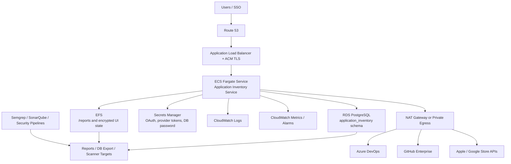

# AWS Deployment Guide

This guide describes a production-ready AWS deployment for Application Inventory Service.

## Recommended Architecture

Use Amazon ECS on Fargate behind an HTTPS Application Load Balancer. Store normalized inventory in Amazon RDS for PostgreSQL. Persist reports and encrypted UI state on Amazon EFS. Store secrets in AWS Secrets Manager and encrypt data with AWS KMS.



## AWS Services

| Service | Use |
| --- | --- |
| ECS Fargate | Runs the container without host management |
| ECR | Stores the container image |
| ALB | Provides HTTPS ingress and health checks |
| ACM | Issues TLS certificate for the UI domain |
| Route 53 | DNS for the service |
| RDS PostgreSQL | Stores normalized inventory |
| EFS | Persists report files and UI state |
| Secrets Manager | Stores OAuth secrets, provider tokens, and database credentials |
| KMS | Encrypts RDS, EFS, Secrets Manager, and log data |
| CloudWatch | Logs, metrics, alarms |
| WAF | Optional edge protection for the ALB |
| NAT Gateway / VPN / Transit Gateway | Outbound access to Azure DevOps or GitHub Enterprise |

## Security Defaults

Use the following controls as the default production posture:

- Run ECS tasks in private subnets with `assignPublicIp=DISABLED`.
- Terminate TLS at the ALB with ACM certificates and redirect HTTP to HTTPS.
- Restrict ALB ingress to approved CIDR ranges, VPN, identity-aware access, or AWS WAF.
- Use immutable image tags and deploy by image digest for production changes.
- Enable ECR scan-on-push and continuously scan final container images.
- Store all runtime secrets in Secrets Manager; never pass GitHub App keys, PATs, OAuth secrets, or DSNs as plain task definition environment values.
- Encrypt ECR, RDS, EFS, Secrets Manager, CloudWatch Logs, and Fargate ephemeral storage with AWS-managed or customer-managed KMS keys.
- Use a dedicated ECS task role with only the secret, KMS, EFS, and logging permissions required by the service.
- Keep RDS public access disabled and allow PostgreSQL only from the ECS task security group.
- Disable local test login in every shared environment.

## Network Layout

Use at least two Availability Zones.

- Public subnets: ALB and NAT gateways.
- Private application subnets: ECS Fargate tasks.
- Private data subnets: RDS and EFS mount targets.
- Security groups:
  - ALB accepts `443` from approved users or corporate IP ranges.
  - ECS accepts app port `48731` only from the ALB.
  - RDS accepts `5432` only from ECS.
  - EFS accepts `2049` only from ECS.

## Container Build and Push

```bash
AWS_REGION=us-east-1
ACCOUNT_ID=$(aws sts get-caller-identity --query Account --output text)
REPO=application-inventory-service

aws ecr create-repository \
  --repository-name "$REPO" \
  --region "$AWS_REGION" \
  --image-tag-mutability IMMUTABLE \
  --image-scanning-configuration scanOnPush=true \
  --encryption-configuration encryptionType=AES256 \
  || true

aws ecr get-login-password --region "$AWS_REGION" \
  | docker login --username AWS --password-stdin "$ACCOUNT_ID.dkr.ecr.$AWS_REGION.amazonaws.com"

IMAGE_TAG=1.6.16
docker build -t "$REPO:$IMAGE_TAG" .
docker tag "$REPO:$IMAGE_TAG" "$ACCOUNT_ID.dkr.ecr.$AWS_REGION.amazonaws.com/$REPO:$IMAGE_TAG"
docker push "$ACCOUNT_ID.dkr.ecr.$AWS_REGION.amazonaws.com/$REPO:$IMAGE_TAG"

IMAGE_DIGEST=$(aws ecr describe-images \
  --repository-name "$REPO" \
  --image-ids imageTag="$IMAGE_TAG" \
  --region "$AWS_REGION" \
  --query 'imageDetails[0].imageDigest' \
  --output text)

echo "$ACCOUNT_ID.dkr.ecr.$AWS_REGION.amazonaws.com/$REPO@$IMAGE_DIGEST"
```

Use the digest form in production task definitions. Keep the version tag for human readability and the digest for deployment integrity.

## Required Secrets

Store these in AWS Secrets Manager:

| Secret | Purpose |
| --- | --- |
| `APPLICATION_INVENTORY_SERVICE_SECRET_KEY` | Fernet key for encrypted token storage |
| `APPLICATION_INVENTORY_SERVICE_GHE_CLIENT_SECRET` | GitHub Enterprise OAuth secret |
| `APPLICATION_INVENTORY_SERVICE_GOOGLE_CLIENT_SECRET` | Google OAuth secret |
| `APPLICATION_INVENTORY_POSTGRES_DSN` | PostgreSQL DSN |
| `APPLICATION_INVENTORY_OBSERVABILITY_DSN` | PostgreSQL DSN for service logs; use the inventory DSN only when the same database is approved |
| `APPLICATION_INVENTORY_OBSERVABILITY_SCHEMA` | PostgreSQL schema for service logs; defaults to `application_inventory` |
| `APPLICATION_INVENTORY_GITHUB_APP_ID` | GitHub App ID |
| `APPLICATION_INVENTORY_GITHUB_APP_INSTALLATION_ID` | GitHub App installation ID |
| `APPLICATION_INVENTORY_GITHUB_APP_PRIVATE_KEY_FILE` | Path to a secret-mounted GitHub App PEM key |
| `APPLICATION_INVENTORY_GITHUB_API_URL` | Backend-only GitHub API endpoint; defaults to `https://api.github.com` |
| `APPLICATION_INVENTORY_GITHUB_URLS` | Comma-separated or newline-separated GitHub owners |
| `APPLICATION_INVENTORY_GITHUB_REPOSITORIES` | Optional `OWNER=REPOSITORY` defaults |
| Provider tokens | Optional Azure DevOps PAT or legacy GitHub token fallback |

Generate a Fernet key:

```bash
python - <<'PY'
from cryptography.fernet import Fernet
print(Fernet.generate_key().decode())
PY
```

Use automatic rotation where supported. For third-party PATs, set an owner, expiration date, and documented rotation cadence.

## ECS Task Configuration

Container:

- Image: ECR image pushed above.
- Port: `48731`.
- Command:

```text
ui --host 0.0.0.0 --port 48731 --reports-dir /reports
```

Environment:

| Variable | Recommended value |
| --- | --- |
| `APPLICATION_INVENTORY_SERVICE_UI_HOST` | `0.0.0.0` |
| `APPLICATION_INVENTORY_SERVICE_UI_PORT` | `48731` |
| `APPLICATION_INVENTORY_SERVICE_REPORTS_DIR` | `/reports` |
| `APPLICATION_INVENTORY_SERVICE_COOKIE_SECURE` | `true` |
| `APPLICATION_INVENTORY_SERVICE_TEST_LOGIN_ENABLED` | `false` |
| `APPLICATION_INVENTORY_SERVICE_PUBLIC_URL` | `https://inventory.example.com` |
| `APPLICATION_INVENTORY_SERVICE_GHE_BASE_URL` | `https://github.enterprise.example` when Enterprise OAuth sign-in is enabled |
| `APPLICATION_INVENTORY_SERVICE_ALLOWED_GITHUB_HOSTS` | Approved GitHub Enterprise hostnames |
| `APPLICATION_INVENTORY_SERVICE_ALLOW_INSECURE_PROVIDER_URLS` | `false` |
| `APPLICATION_INVENTORY_SERVICE_MAX_JSON_BODY_BYTES` | `1048576` |
| `APPLICATION_INVENTORY_SERVICE_MAX_CONCURRENT_SCANS` | `2` |
| `APPLICATION_INVENTORY_GITHUB_REQUESTS_PER_SECOND` | `8` |
| `APPLICATION_INVENTORY_GITHUB_RATE_LIMIT_RESERVE` | `50` |
| `APPLICATION_INVENTORY_XLSX_CHECKPOINT_ROWS` | `500` |
| `APPLICATION_INVENTORY_XLSX_MAX_CHECKPOINT_ROWS` | `5000` |
| `APPLICATION_INVENTORY_XLSX_CHECKPOINT_SECONDS` | `30` |
| `APPLICATION_INVENTORY_POSTGRES_COMMIT_ROWS` | `50` |
| `APPLICATION_INVENTORY_POSTGRES_COMMIT_SECONDS` | `1` |
| `APPLICATION_INVENTORY_POSTGRES_SCHEMA` | `application_inventory` |
| `APPLICATION_INVENTORY_POSTGRES_TABLE` | `application_inventory_assets` |

Mount EFS at `/reports`. Reports, encrypted credentials, and encrypted schedules use this durable path. Keep `APPLICATION_INVENTORY_SERVICE_SECRET_KEY` stable across task replacements; changing it makes existing encrypted state unreadable.

Runtime hardening:

- Run as the non-root `scanner` user provided by the container image.
- Set `readonlyRootFilesystem` to `true`.
- Write only to the mounted `/reports` volume and task temporary storage.
- Do not grant privileged mode.
- Do not add Linux capabilities.
- Use Fargate platform version `1.4.0` or later.
- Use task-level CPU and memory limits that leave headroom for large report generation.
- Keep ECS Exec disabled unless there is an approved break-glass process with audit logging.

Health check path:

```text
/api/health
```

Expected response:

```json
{"status":"ok"}
```

## OAuth Callback URLs

Configure OAuth apps with the public ALB or Route 53 hostname:

Use [GitHub SSO](GITHUB_SSO.md) for the complete GitHub OAuth registration, secret, scope, proxy, and verification procedure.

```text
https://inventory.example.com/api/auth/github-enterprise/callback
https://inventory.example.com/api/auth/google/callback
```

## Database

Recommended RDS settings:

- Engine: PostgreSQL 16 or later.
- Storage encryption: enabled.
- Multi-AZ: enabled for production.
- Backups: 7 to 35 days, based on retention policy.
- Public access: disabled.
- IAM authentication: optional.
- Performance Insights: enabled.
- Deletion protection: enabled.
- SSL/TLS connections: required by parameter group or connection policy.
- Minor version auto-upgrades: enabled where compatible with your release process.

The service creates the `application_inventory` schema automatically when PostgreSQL sync is enabled.

## IAM

Task execution role:

- Pull from ECR.
- Write CloudWatch logs.
- Read only the image and log resources needed by this service.

Task role:

- Read required Secrets Manager secrets.
- Decrypt with the relevant KMS key.
- Mount EFS if using IAM authorization.
- No wildcard secret access.
- No RDS administrative permissions.

Avoid broad permissions. Scope secrets by ARN and environment.

## Scaling

Start with one task. Active processes and event listeners are local to that task. Increase desired count only after introducing request affinity or external scan coordination. Use `APPLICATION_INVENTORY_SERVICE_MAX_CONCURRENT_SCANS` to bound interactive and scheduled subprocesses inside the task.

Pause and resume use POSIX process-group signals and are supported by Fargate Linux. A task replacement terminates active or paused scans; persisted schedules reload in the replacement task.

Recommended first production setting:

- Desired tasks: `1`.
- CPU: `1024`.
- Memory: `2048` or `4096`.
- ALB idle timeout: `300` seconds.
- ECS deployment minimum healthy percent: `100`.

Large organizations are usually constrained by provider API limits. Increase scan worker settings cautiously.

## Observability

Create CloudWatch alarms for:

- ECS task restarts.
- ALB `5xx` count.
- Target response time.
- RDS CPU and storage.
- RDS connections.
- EFS burst credits.

Ship logs to a central SIEM if inventory results or errors may support audit or incident response.

## Backup and Retention

- RDS: automated backups plus snapshots before upgrades.
- EFS: AWS Backup policy for reports and encrypted token state.
- Reports: define retention by data sensitivity and internal policy.
- Secrets: rotate OAuth and provider tokens on a defined cadence.

## Security Hardening

- Disable test login in every shared environment.
- Enforce HTTPS only.
- Restrict ALB access by corporate IP, VPN, WAF, or identity-aware access.
- Use read-only source provider tokens.
- Store secrets only in Secrets Manager.
- Rotate any token that has appeared in chat, logs, screenshots, terminal output, or issue trackers.
- Use customer-managed KMS keys when required by policy.
- Keep ECS tasks in private subnets.
- Prefer VPC endpoints for AWS APIs where practical.
- Configure `APPLICATION_INVENTORY_SERVICE_ALLOWED_GITHUB_HOSTS` to reduce provider URL abuse risk.
- Redact provider tokens and DSNs from operational runbooks, tickets, and screenshots.
- Route CloudWatch Logs to retention policies that match the sensitivity of inventory metadata.
- Use Security Hub and GuardDuty where available for RDS, ECS, and runtime findings.
- Require review for worker-count changes because aggressive concurrency can trigger provider throttling or unnecessary data exposure.

## Deployment Checklist

1. Create or validate VPC, subnets, routing, NAT or private connectivity.
2. Create RDS PostgreSQL.
3. Create EFS and mount targets.
4. Create Secrets Manager entries.
5. Build and push the image to ECR.
6. Create ECS task definition and service.
7. Attach ALB target group and health check.
8. Configure Route 53 and ACM certificate.
9. Configure GitHub, GitHub Enterprise, or Google OAuth callback URLs.
10. Run a small project/repository scan.
11. Validate reports, PostgreSQL rows, CloudWatch logs, and scanner target outputs.

## Rollback

Use immutable image tags. To roll back, update the ECS service to the previous task definition revision and redeploy. Keep database schema changes backward-compatible when possible.

## References

- [Amazon ECS security](https://docs.aws.amazon.com/AmazonECS/latest/developerguide/security.html)
- [Fargate security best practices](https://docs.aws.amazon.com/AmazonECS/latest/developerguide/security-fargate.html)
- [Amazon RDS security best practices](https://docs.aws.amazon.com/AmazonRDS/latest/UserGuide/CHAP_BestPractices.Security.html)
- [AWS Secrets Manager rotation](https://docs.aws.amazon.com/secretsmanager/latest/userguide/rotating-secrets.html)
- [Amazon EFS encryption](https://docs.aws.amazon.com/efs/latest/ug/encryption.html)
